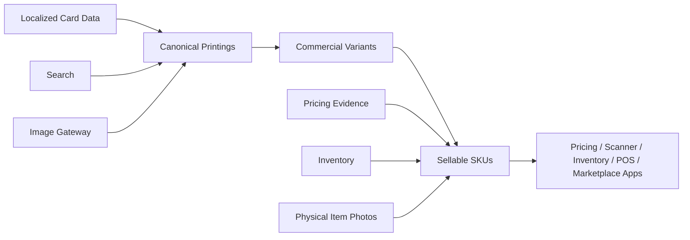

# SaveRoom Pokémon Card Database API


> A reusable backend brain for Pokémon TCG products — powering multilingual card data, pricing evidence, inventory workflows, and app-ready APIs for SaveRoom apps.

## Overview

The **SaveRoom Pokémon Card Database API** is the core backend platform for SaveRoom’s Pokémon TCG ecosystem.

It is built to serve multiple downstream products:

- scanner and collector apps
- POS and inventory tools
- listing / marketplace workflows
- web trackers and admin tools
- future customer-facing SaveRoom apps

This repository is **not just a card dump**. It is a structured, API-first data platform with:

- strict language-by-language integrity
- canonical card and SKU modeling
- pricing evidence and chart-ready price history
- inventory and physical item support
- deterministic listing and workflow endpoints
- a separate browser UI for local exploration

The current stable release is **v12.2.0**.

---

## Current Status

| Field | Value |
|---|---|
| Stable Release | `v12.2.0` |
| Current Branch | `main` |
| Current HEAD | `4a3d91806999b168c6866c0c4f050ddae8557205` |
| Release State | Released and tagged |
| Latest Verification | `937 passed, 1 skipped, 19 warnings` |
| OpenAPI Version | `3.1.0` |
| Paths | `89` |
| Schemas | `122` |
| Unique Operation IDs | `102` |
| Duplicate Operation IDs | `[]` |

---

## What This Project Does

### Core purpose

This API provides the structured data and business logic layer for SaveRoom’s Pokémon TCG products.

It handles:

- card search and lookup
- multilingual card data delivery
- canonical printings and commercial variants
- sellable SKUs for downstream products
- pricing evidence and price history
- inventory and physical item workflows
- deterministic listing assistant output
- read-only workflow summary endpoints

### What it is not

This repository is **not** the scanner app.

The scanner / collector frontend lives in a **separate repo**:

| Project | Purpose |
|---|---|
| `SaveRoom-Pokemon-Database-API` | Backend brain / API / data platform |
| `SaveRoom-Scanner-App` | Separate frontend / scanner client |

That separation is intentional: the app should consume the API, not embed the database brain.

---

## Architecture



### Data flow

| Stage | Meaning |
|---|---|
| Localized card data | Source content across languages |
| Canonical printings | Stable card identity layer |
| Commercial variants | Business-facing product variants |
| Sellable SKUs | Records downstream apps actually use |
| Apps | Scanner, inventory, pricing, POS, marketplace clients |

---

## Key Features

| Feature | Description |
|---|---|
| Multilingual card support | Preserves language-specific card data |
| No silent fallback | Missing data is reported, not guessed |
| Search | Local card discovery and lookup |
| Image gateway | Card image handling and delivery |
| Canonical printings | Normalized card identity |
| Commercial variants | Business-relevant product modeling |
| Sellable SKUs | Inventory-ready product records |
| Pricing evidence | Source-aware local pricing history |
| Physical item photos | Real-world item image support |
| Inventory workflows | Item, sale, and listing state handling |
| Deterministic listing assistant | Marketplace-ready listing data |
| OpenAPI contract | Clean, documented API surface |

---

## Important Product Principles

| Principle | Meaning |
|---|---|
| Strict language integrity | A language row stays in its own language |
| No silent fallback | Do not substitute another language invisibly |
| Source-backed coverage | Prefer verified data over guessed coverage |
| API-first | The API is the source of truth |
| Separate frontend | Apps consume the API instead of embedding it |
| App-readiness | The backend should be usable by real clients |

---

## Key API Surface

### Current / notable endpoints

| Endpoint | Purpose |
|---|---|
| `/health` | Service health check |
| `/search?q=...` | Card search |
| `/cards/{language_code}/{card_id}` | Card detail by language + source ID |
| `/reports/coverage` | Coverage / completeness report |
| `/api/v1/cards/{card_key}/detail` | App-ready card detail |
| `/api/v1/cards/detail/batch` | Batch card detail |
| `/api/v1/prices/chart/cards/{card_key}` | Chart-ready price history |
| `/api/v1/inventory/items` | Inventory list with app/POS filters |
| `/api/v1/inventory/items/{item_id}/workflow` | Inventory workflow summary |
| `/api/v1/listings/drafts` | Local listing drafts |
| `/api/v1/listings/drafts/{draft_id}/workflow` | Listing draft workflow summary |
| `/api/v1/sales/summary` | Local sales aggregate summary |

---

## Release Highlights

### v12.2.0

The v12.2.0 release completed the API/client/app-readiness line.

#### Included work

| Area | Result |
|---|---|
| Inventory item list filters | Added and polished |
| POS search | Improved |
| POS-ready fixture pack | Added |
| OpenAPI schema hygiene | Cleaned up |
| Operation IDs | Made unique |
| Local sales summary | Typed |
| App transition planning | Documented |

#### Result

| Item | Status |
|---|---|
| Version | `v12.2.0` |
| Branch | `main` |
| Tag | Released and pushed |
| Purpose | Backend/client readiness |

---

## Repository Layout

| Path | Purpose |
|---|---|
| `pokemon_db_v2_fastapi.py` | Main FastAPI service |
| `pokemon_db_v2_search_api.py` | Search layer and support objects |
| `pokemon_db_v3_config.py` | Settings and CLI/config helpers |
| `pokemon_db_v5_api_models.py` | API models |
| `pokemon_db_cli.py` | Maintenance / command-line entrypoint |
| `pokemon_db_v2_browser_ui/` | Lightweight browser UI over the API |
| `pricing_sources/` | Pricing adapters and pricing policy code |
| `docs/` | Release notes, audits, fixtures, contract docs |
| `tests/` | API and contract tests |
| `full_tcgdex/` | SQLite database and related data files |
| `images/` | Image assets |
| `image_cache/` | Local image cache |
| `recovered_images/` | Recovered image output |
| `scripts/` | Utility scripts |
| `ptcg_db_repo/` | Legacy / reference repo content |
| `fill_*.py`, `scrape_*.py`, `cleanup_*.py` | Data recovery and maintenance scripts |

---

## Running Locally

### Start the API

```bash
python3 pokemon_db_v2_fastapi.py --host 127.0.0.1 --port 8765
```

### Open the browser UI

```text
http://127.0.0.1:8765/ui/
```

### Optional flags

The FastAPI service supports local configuration for:

- database path
- UI directory
- image cache directory
- reports directory
- host
- port
- CORS origin

---

## Browser UI

The browser UI is a lightweight local interface over the API.

### What it does

| Feature | Purpose |
|---|---|
| Search box | Query the card search endpoint |
| Language filter | Narrow by language |
| Core set filter | Filter by set grouping |
| Image-only toggle | Show cards with images |
| Result count | View returned item count |
| API timing | See response timing |
| Card grid | Browse search results visually |
| Detail modal | Inspect full card data |
| JSON copy | Copy response payloads |
| Draft copy | Copy product / Shopify-style fields |

### Open it

```text
http://127.0.0.1:8765/ui/
```

You can also open `pokemon_db_v2_browser_ui/index.html` directly and point it at the local API.

---

## Data Model Direction

```text
Localized cards
→ Canonical printings
→ Commercial variants
→ Sellable SKUs
→ Pricing / Scanner / Inventory / POS / Marketplace apps
```

This structure keeps the backend reusable across multiple SaveRoom products.

---

## Roadmap

| Version | Direction | Status |
|---|---|---|
| `v12.2.0` | API/client/app-readiness | Released |
| `v12.3.0` | App user/auth/entitlement foundation | Planned |
| `v12.4.0` | Scanner/collector backend foundation | Planned |
| `v12.5.0` | Paid beta readiness | Planned |
| `v13.0` | Major platform shift | Requires explicit approval |

### Current direction

The next practical work is:

- separate scanner app frontend work
- real API consumption from the app
- app auth / entitlement planning
- continued backend polish only where the app exposes real gaps

Do **not** start `v13` without explicit approval.

---

## Verification

| Check | Result |
|---|---|
| Full test suite | `937 passed, 1 skipped, 19 warnings` |
| OpenAPI build | Clean |
| Operation IDs | Unique |
| Release state | Tagged and pushed |
| Main/tag alignment | Confirmed |

---

## Notes

- The API is the backend brain, not the frontend product.
- The scanner app should remain separate.
- Language fallback must stay explicit.
- Pricing evidence is backend-managed and source-aware.
- Older v5–v9 notes are historical unless explicitly marked current.

---

## License

Add your chosen license here if/when you publish the repository publicly.

## Contact

Add maintainer or project contact info here if you want it on the public page.
